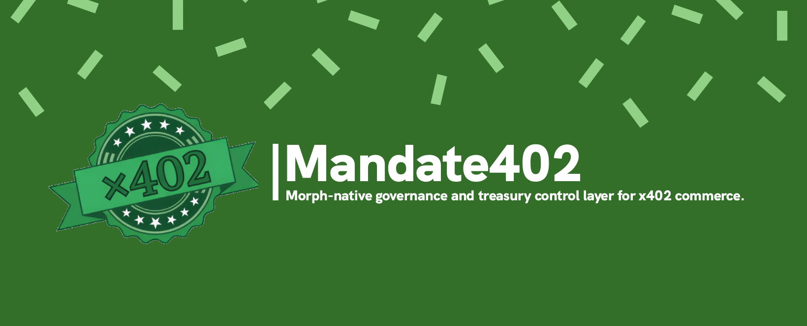

<div align="center">
  
  <h1>Mandate402</h1>
  <p><strong>The autonomous governance and treasury command center for x402 machine commerce on Morph.</strong></p>

  <p>
    <a href="https://github.com/JustineDevs/mandate402"></a>
    
    
    
    
    
    
  </p>
</div>

> [!IMPORTANT]
> Mandate402 is the treasury governance and guardrail layer for x402 agentic commerce on Morph.
> It does **not** replace the x402 facilitator and it does **not** replace the paid vendor service.

> [!WARNING]
> Never commit `.env.local`, private keys, Morph x402 HMAC credentials, or deployment cache files.

Mandate402 is a Morph-native governance and treasury control layer for x402 commerce. This repository implements the `v0.1.0` MVP operator loop:

- issue a mandate
- run one approved payment attempt
- block one invalid payment attempt before dispatch
- inspect financial outcome and receipt evidence
- revoke the mandate

## Problem

Autonomous agents can pay through `HTTP 402`, but organizations still lack a safe treasury layer between:

- an untrusted or partially trusted agent
- a paid API or tool
- the payment facilitator
- the corporate or DAO treasury

Without a control plane, a looped or adversarial agent can drain funds at machine speed.

## Solution

Mandate402 inserts a programmable policy boundary before x402 settlement:

- the agent requests a paid action
- Mandate402 checks budget, facilitator allowlist, receipt expectations, and treasury policy
- the payment either proceeds or is blocked
- ambiguous outcomes remain reserved until correlation proves final truth
- all key steps are visible in the audit trail

## Project Snapshot

| Area | Status | Notes |
|---|---|---|
| Next.js operator console | Ready locally | Mandate create / attempt / revoke / reconcile flows implemented |
| Treasury contracts | Ready locally | `MandateRegistry` and `Mandate402Treasury` tested with Foundry |
| Morph Hoodi treasury deploy | Deployed | `0xD08301fEAc731dDe33b81059A59A69c1A1B5DD60` |
| Go x402 demo merchant | Runnable | Uses Morph Hoodi facilitator via env |
| Real external vendors | Not yet live | Local demo vendors are provided |

## Acknowledgements

Mandate402 is built with and for the broader agentic payments ecosystem:

- **Morph** for low-latency, low-cost settlement and facilitator infrastructure
- **Pyth Network** for oracle-backed fiat-denominated treasury guardrails
- **x402** for the machine-payable HTTP 402 standard

## Status

This repo is scaffolded for the approved plan in `.omx/plans/mandate402-v0-1-0-consensus-approved.md`.

Current implementation includes:

- a modular-monolith Next.js app
- mandate, policy, payment, receipt, vendor, and auth modules
- a canonical fallback-gate artifact
- local-file demo persistence
- unit tests for the critical state machine and policy logic

The contract workspace lives under `contracts/`.

<details>
<summary><strong>What is already production-shaped vs still demo-shaped?</strong></summary>

Production-shaped:

- contract architecture
- local policy / reconciliation logic
- deployed treasury contract on Morph Hoodi
- x402 merchant sample with real 402 challenges

Still demo-shaped:

- local file persistence
- local controlled vendor endpoints
- environment-driven live vendor URLs not yet replaced with third-party services

</details>

## Architecture

| Layer | Responsibility | Current implementation |
|---|---|---|
| Vendor | The paid service being purchased | Local Go x402 demo merchant endpoints |
| Facilitator | x402 discover / verify / settle infra | Morph facilitator URLs |
| Mandate402 | Treasury guardrails and policy | Next app + Solidity contracts |
| Oracle | Fiat-denominated safety checks | Pyth in `Mandate402Treasury.sol` |

<details>
<summary>Why this separation matters</summary>

If these roles are mixed together, the system becomes misleading:

- the facilitator is not a market-data API
- the vendor is not the treasury
- the treasury is not the oracle

Mandate402 wins the x402 track by sitting **between** autonomous payment intent and actual settlement, enforcing policy before value leaves the treasury.

</details>

## Commands

```bash
pnpm install
pnpm dev
pnpm test
pnpm typecheck
pnpm build
```

Additional:

```bash
cd contracts && FOUNDRY_CACHE_PATH=cache FOUNDRY_OUT=out forge test
go build -buildvcs=false .
go test ./...
```

## Runtime Setup

Copy `.env.example` to `.env.local` and provide:

- `MANDATE402_OPERATOR_TOKEN`
- `MANDATE402_TESTNET_RPC_URL`
- `MANDATE402_TESTNET_CHAIN_ID`
- `MANDATE402_TESTNET_EXPLORER_URL`
- `MANDATE402_PYTH_ORACLE_ADDRESS`
- `MANDATE402_PYTH_ETH_USD_FEED_ID`
- `MANDATE402_PYTH_USDC_USD_FEED_ID`
- `MORPH_RPC_URL`
- `MORPH_EXPLORER_URL`
- `MORPH_X402_FACILITATOR_URL`
- `MORPH_HOODI_X402_FACILITATOR_URL`
- `MORPH_X402_ACCESS_KEY`
- `MORPH_X402_SECRET_KEY`
- `MORPH_PRIVATE_KEY`
- `MANDATE_REGISTRY_ADDRESS`
- `PRIMARY_X402_VENDOR_A_URL`
- `PRIMARY_X402_VENDOR_B_URL`

Without those values, the app remains structurally correct but cannot prove the live Morph anchor path or the real primary-vendor path.

> [!TIP]
> For a safe local demo, you do **not** need third-party vendors immediately. You can use the bundled Go x402 merchant as Vendor A and Vendor B.

## Deployment Summary

| Item | Value |
|---|---|
| Network | Morph Hoodi Testnet |
| Chain ID | `2910` |
| Treasury contract | `0xD08301fEAc731dDe33b81059A59A69c1A1B5DD60` |
| Deployment tx | `0xfd0b1f2312437a97e791aad3cd14ca251b86b70ffa42215d48b92a2c8c9ff147` |
| Explorer contract | `https://explorer-hoodi.morph.network/address/0xD08301fEAc731dDe33b81059A59A69c1A1B5DD60` |
| Explorer tx | `https://explorer-hoodi.morph.network/tx/0xfd0b1f2312437a97e791aad3cd14ca251b86b70ffa42215d48b92a2c8c9ff147` |

## Contract Verification

The repo includes a dedicated Morph verification workflow:

- [`.github/workflows/verify-contract.yml`](./.github/workflows/verify-contract.yml)

Manual Foundry command:

```bash
cd contracts
forge verify-contract \
  0xD08301fEAc731dDe33b81059A59A69c1A1B5DD60 \
  src/Mandate402Treasury.sol:Mandate402Treasury \
  --chain 2910 \
  --verifier blockscout \
  --verifier-url https://explorer-hoodi.morph.network/api \
  --watch
```

## Why Morph Matters

| Morph capability | Why it matters to Mandate402 |
|---|---|
| Low-fee, fast testnet settlement | makes machine-speed micro-payments viable |
| Facilitator support for x402 | simplifies verify/settle flows |
| Hoodi deployment target | gives judges a real live contract to inspect |
| Public explorer and RPC | makes the architecture transparent and verifiable |

## Real Public Morph Values

These public values can be used as-is:

- `MANDATE402_TESTNET_RPC_URL=https://rpc-hoodi.morph.network`
- `MANDATE402_TESTNET_CHAIN_ID=2910`
- `MANDATE402_TESTNET_EXPLORER_URL=https://explorer-hoodi.morph.network/`
- `MANDATE402_PYTH_ORACLE_ADDRESS=0xA2aa501b1a2434E0341E02FdD29810850D2434E0`
- `MANDATE402_PYTH_ETH_USD_FEED_ID=0xff61491a931112ddf1bd8147cd1b641375f79f582bb9473d47a502f86ef44195`
- `MANDATE402_PYTH_USDC_USD_FEED_ID=0xeaa020c61cc479712813461ce153894b96a6c00b21ed0cfc2798d1f9a9e9c94a`
- `MORPH_RPC_URL=https://rpc-quicknode.morph.network`
- `MORPH_CHAIN_ID=2818`
- `MORPH_EXPLORER_URL=https://explorer.morph.network`
- `MORPH_X402_FACILITATOR_URL=https://morph-rails.morph.network/x402`
- `MORPH_HOODI_X402_FACILITATOR_URL=https://morph-rails-hoodi.morph.network/x402/v2`

These values are still project-specific and cannot be truthfully prefilled:

- `MORPH_PRIVATE_KEY`
- `MANDATE_REGISTRY_ADDRESS`
- `PRIMARY_X402_VENDOR_A_URL`
- `PRIMARY_X402_VENDOR_B_URL`
- `MANDATE402_X402_DEMO_VENDOR_URL`
- `MORPH_X402_ACCESS_KEY`
- `MORPH_X402_SECRET_KEY`

The last three must point to real x402-capable vendor or wrapper endpoints that expose both:

- a payment execution endpoint at the base URL
- a correlation endpoint at `BASE_URL/status`

## Facilitator vs Vendor

Important distinction:

- `Morph x402 Facilitator` is payment infrastructure for `discover / verify / settle`
- `vendor endpoint` is the actual paid service being bought

That means:

- `https://morph-rails.morph.network/x402` and `https://morph-rails-hoodi.morph.network/x402/v2` are facilitator URLs
- they are **not** market-data or research vendor URLs

> [!CAUTION]
> If you point `PRIMARY_X402_VENDOR_A_URL` or `PRIMARY_X402_VENDOR_B_URL` at the Morph facilitator, your architecture becomes conceptually wrong. The facilitator is settlement infra, not the paid service being purchased.

The onboarding wizard `main.go` in this repo is a sample paid x402 merchant server. If you run it locally, it can serve as controlled demo vendor endpoints:

- vendor A: `http://localhost:8000/x402_demo/api/market-data`
- vendor B: `http://localhost:8000/x402_demo/api/research`
- fallback demo vendor: `http://localhost:8000/x402_demo/api/resource`
- payment infra: Morph Hoodi facilitator with HMAC credentials from env

That is useful for demo/fallback validation, but it does not magically create two real third-party data vendors.

## External Provider Integration

The local x402 demo vendors can pull upstream crypto market data from either:

| Provider | Role in this repo | Auth shape |
|---|---|---|
| CoinMarketCap Pro API | upstream market-data provider behind Vendor A / Vendor B | `X-CMC_PRO_API_KEY` |
| CoinAPI Market Data API | upstream market-data provider behind Vendor A / Vendor B | `X-CoinAPI-Key` |

Important:

- these providers are **upstream data sources**
- they are **not** x402 facilitators
- they are **not** Mandate402 vendors by themselves until wrapped by our Go x402 merchant

The Go merchant chooses provider behavior using:

```bash
MANDATE402_MARKET_PROVIDER=demo|coinmarketcap|coinapi
CMC_API_KEY=...
COINAPI_KEY=...
```

Provider mapping in code:

- [main.go](./main.go) -> `fetchCoinMarketCapMarketData()`
- [main.go](./main.go) -> `fetchCoinAPIMarketData()`

If no provider key is configured, the merchant falls back to deterministic demo payloads.

## Local Demo Vendors

The repo now provides concrete local vendor endpoints through the Go x402 demo merchant:

| Role | Endpoint | Purpose |
|---|---|---|
| Vendor A | `http://localhost:8000/x402_demo/api/market-data` | fast successful paid response |
| Vendor B | `http://localhost:8000/x402_demo/api/research` | intentionally slow response to trigger `execution_unknown` then reconciliation |
| Vendor status A | `http://localhost:8000/x402_demo/api/market-data/status` | correlation endpoint |
| Vendor status B | `http://localhost:8000/x402_demo/api/research/status` | correlation endpoint |
| Fallback vendor | `http://localhost:8000/x402_demo/api/resource` | controlled fallback path |

## Verification Matrix

| Surface | Verification |
|---|---|
| Next.js app logic | `pnpm test` |
| Type safety | `pnpm typecheck` |
| Source lint | `pnpm exec eslint src next.config.ts eslint.config.mjs vitest.config.ts` |
| Biome policy | `pnpm check:biome` |
| Repo safety | `pnpm check:repo-safety` |
| Release readiness | `pnpm check:release-readiness` |
| Treasury contracts | `forge test` |
| Go merchant compile | `go build -buildvcs=false .` |
| Go module sanity | `go test ./...` |

<details>
<summary>How the unknown-attempt demo works</summary>

The `research` route deliberately sleeps longer than the Next app correlation timeout. That makes Mandate402 record:

1. payment dispatched
2. execution becomes `execution_unknown`
3. reservation remains held
4. operator clicks `Reconcile Unknown`
5. app calls the vendor `/status` endpoint
6. vendor returns final truth
7. budget and audit trail reconcile

</details>

## Recommended Live Values Strategy

Use these exact public Morph values now:

```bash
MORPH_RPC_URL=https://rpc-quicknode.morph.network
MORPH_CHAIN_ID=2818
MORPH_EXPLORER_URL=https://explorer.morph.network
MORPH_X402_FACILITATOR_URL=https://morph-rails.morph.network/x402
```

You still need to provide:

```bash
MORPH_PRIVATE_KEY=0x...
MANDATE_REGISTRY_ADDRESS=0x...
PRIMARY_X402_VENDOR_A_URL=http://localhost:8000/x402_demo/api/market-data
PRIMARY_X402_VENDOR_B_URL=http://localhost:8000/x402_demo/api/research
```

Backward-compatible aliases still work:

```bash
MORPH_MARKET_DATA_URL=...
MORPH_RESEARCH_NET_URL=...
MANDATE402_DEMO_WRAPPER_URL=...
```

## Go Demo Vendor

This repo includes a minimal Go x402 merchant sample in [main.go](./main.go).

Use it as a controlled demo vendor:

```bash
go mod tidy
go run .
```

The Next app can treat:

- `PRIMARY_X402_VENDOR_A_URL=http://localhost:8000/x402_demo/api/market-data`
- `PRIMARY_X402_VENDOR_B_URL=http://localhost:8000/x402_demo/api/research`
- `MANDATE402_X402_DEMO_VENDOR_URL=http://localhost:8000/x402_demo/api/resource`

as local controlled demo vendors.

## Hackathon Fit

| Requirement | How Mandate402 addresses it |
|---|---|
| x402 HTTP 402 payment loop | Go merchant exposes paid routes, Next app governs attempts before settlement |
| Rogue-agent prevention | velocity window, facilitator allowlist, kill-switch, auth, reconciliation |
| Morph-native advantage | deployed treasury on Morph Hoodi, Morph facilitator integration, public Morph RPC/explorer wiring |
| Volatility-aware control | `Mandate402Treasury` uses Pyth price feeds for USD-denominated spend caps |

## Repository Hygiene

This repository is prepared to avoid pushing unnecessary or sensitive material:

- dependencies ignored
- build artifacts ignored
- deployment cache ignored
- secrets ignored
- internal secret note ignored

See [CONTRIBUTING.md](./CONTRIBUTING.md) for contribution and verification guidance.

## Contributing

Contributions should preserve three boundaries:

- facilitator infra must stay separate from vendor endpoints
- `execution_unknown` must not be treated as reconciled before truth is fetched
- treasury guardrails must remain test-backed

See [CONTRIBUTING.md](./CONTRIBUTING.md) for setup, verification, and secret-handling guidance.

## Treasury Deployment

The Pyth-powered treasury contract lives at:

- [contracts/src/Mandate402Treasury.sol](./contracts/src/Mandate402Treasury.sol)

Foundry deployment script:

- [contracts/script/DeployMandate402Treasury.s.sol](./contracts/script/DeployMandate402Treasury.s.sol)

Example deploy command:

```bash
cd contracts
FOUNDRY_CACHE_PATH=cache FOUNDRY_OUT=out forge script script/DeployMandate402Treasury.s.sol:DeployMandate402TreasuryScript \
  --rpc-url "$MANDATE402_TESTNET_RPC_URL" \
  --broadcast \
  --legacy
```

Required deployment envs:

```bash
MANDATE402_GOVERNANCE_OWNER=0x...
MANDATE402_DEPLOYER_PRIVATE_KEY=0x...
MANDATE402_PYTH_ORACLE_ADDRESS=0xA2aa501b1a2434E0341E02FdD29810850D2434E0
```

Note:

- Earlier Holesky-style values such as `2810` and `rpc-quicknode-holesky.morphl2.io` appeared in older/alternate materials.
- Current official Morph docs now show **Morph Hoodi Testnet** as:
  - RPC: `https://rpc-hoodi.morph.network`
  - Chain ID: `2910`
  - Explorer: `https://explorer-hoodi.morph.network/`
