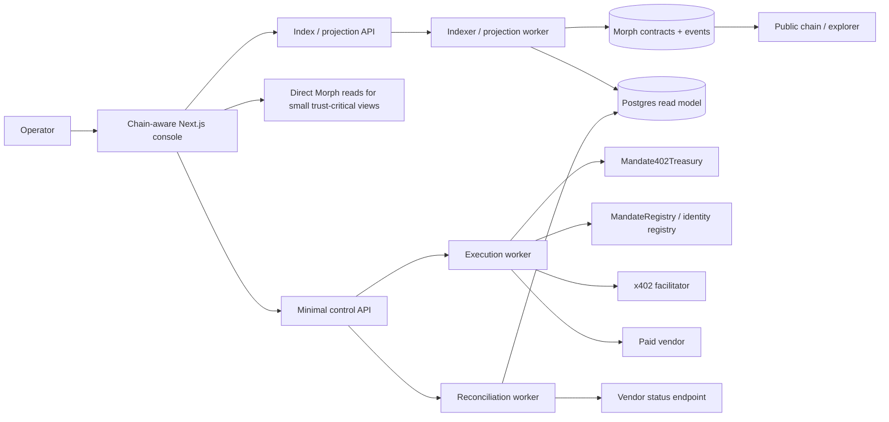

# Morph-First Hybrid Architecture

This document defines the target architecture for Mandate402 after the repository stops depending on laptop-local runtime assumptions and moves toward a Morph-first, deployment-grade operating model.

It is not a generic web3 architecture note. It is specific to Mandate402's role as a governance and treasury control layer for x402 machine payments on Morph.

## 1. Problem Framing

The current repository already contains:

- a real Next.js operator console
- a real policy runtime
- Morph lifecycle anchoring
- an onchain treasury guard contract
- an x402 execution path
- a local or deployable vendor sample service

But the current implementation still leans on a traditional app-server shape:

- policy and attempt orchestration happen offchain first
- local or repository-owned services are still part of the operator story
- read models are app-local
- chain state is important but not yet the primary truth surface for operators

That is no longer the right long-term posture.

Mandate402 should evolve into:

> a Morph-first hybrid architecture where onchain state is the truth layer, deployed workers execute the offchain side effects, and the frontend becomes chain-aware instead of laptop-local or server-local.

## 2. Goals

After this architecture is implemented, Mandate402 should be able to say all of the following truthfully:

- the product does not depend on a laptop-local backend
- trust-critical authority comes from Morph-backed state
- offchain execution is handled by deployed workers, not hidden local runtime processes
- operator-facing state is chain-aware and index-backed
- treasury policy is visible, reviewable, and enforceable through Morph contracts

## 3. Non-Goals

This architecture does **not** try to:

- force all vendor execution onchain
- store every audit payload fully onchain
- eliminate all offchain infrastructure
- turn Mandate402 into a wallet product
- turn Mandate402 into the facilitator
- turn Mandate402 into the vendor

The goal is not "100% onchain".

The goal is:

> onchain truth, offchain execution, and frontend-visible integrity.

## 4. Core Design Principle

Mandate402 should split into three responsibility classes:

### 4.1 Onchain Truth

Morph contracts and events become the canonical source of truth for:

- mandate issuance
- mandate revocation
- treasury policy and facilitator allowlists
- kill-switch authority
- agent-to-onchain-identity mapping
- spend authorization boundaries

### 4.2 Offchain Execution

Workers and deployed services remain responsible for:

- calling vendors
- x402 facilitator interaction
- payment correlation
- private API key usage
- projection/index maintenance
- retry loops

### 4.3 Chain-Aware Presentation

The frontend and query layer should present:

- current mandate state
- treasury state
- chain health
- event-backed audit history
- unresolved execution states

without requiring a laptop-local runtime.

## 5. Target System Boundary

## 6. Onchain Truth Layer

### 6.1 Contracts

The chain-native truth layer should be composed of:

- `MandateRegistry`
  - issue
  - revoke
  - lifecycle truth
- `Mandate402Treasury`
  - spend authorization guard
  - facilitator allowlist
  - kill switch
  - USD-window guardrail
- future `AgentIdentity` / registry surface
  - stable mapping between logical agent IDs and onchain identities

### 6.2 What Must Be Canonical Onchain

These should be treated as canonical onchain truths:

- whether a mandate exists
- whether a mandate is active or revoked
- whether a facilitator is allowed
- whether a treasury rule is currently active
- whether an emergency kill switch is on
- which onchain address or identity corresponds to the authorized agent

### 6.3 What Should Stay Offchain

These should stay offchain:

- long-form audit text
- high-volume vendor payloads
- rich status histories
- arbitrary search indexing
- expensive correlation loops

Those belong in projection and worker layers.

## 7. Worker Execution Layer

Laptop-local execution should be replaced with deployed workers.

### 7.1 Execution Worker

Responsibilities:

- validate operator command
- resolve current chain-backed authority
- call treasury enforcement when configured
- invoke x402 payment flow
- dispatch to vendor endpoint
- write attempt result into the projection model
- emit observability events

### 7.2 Reconciliation Worker

Responsibilities:

- poll unresolved `execution_unknown` attempts
- correlate with vendor truth
- update financial outcome and receipt evidence
- mark unresolved attempts for escalation

### 7.3 Index / Projection Worker

Responsibilities:

- ingest Morph events
- ingest app-side domain events
- project them into queryable Postgres tables
- support dashboard and audit reads

## 8. Read Model / Index Layer

The read layer should be Postgres-backed and indexer-fed.

### 8.1 Why Postgres Stays

Postgres should remain because:

- frontend queries need joins, filtering, pagination, and dashboard summaries
- raw RPC and event scans are not enough for good UX
- audit and system health views need a projection model

### 8.2 What Postgres Should Hold

Postgres should hold:

- projected mandates
- projected attempts
- projected audit entries
- projected domain events
- projected chain event confirmations
- worker lease / retry state
- health snapshots

### 8.3 What Postgres Should Not Be

Postgres should not be treated as the authority source for:

- whether a mandate is valid
- whether a revoke is final
- whether a facilitator is approved

Those are chain-backed truths.

## 9. Frontend: Chain-Aware Reads

The frontend should evolve from a server-local view into a chain-aware operator console.

### 9.1 Direct Reads

Use direct viem or RPC reads for small trust-critical views:

- registry status of a mandate
- treasury guard readiness
- chain health
- configured network / contract surface

### 9.2 Indexed Reads

Use index-backed reads for:

- audit history
- attempt tables
- vendor execution history
- unresolved reconciliation queues
- dashboards and charts

### 9.3 Frontend Trust Model

The frontend should be able to show:

- onchain truth
- projected truth
- worker state
- when they diverge

That is much more credible than a single opaque app-server summary.

## 10. Auth Model

The frontend should stop relying purely on a server-local token boundary.

Recommended direction:

- keep Supabase or equivalent operator auth for app access
- add a stable mapping between authenticated operator identity and permitted onchain authority
- prepare for wallet-linked operator verification where useful

This means:

- app identity for operator access
- chain identity for treasury/mandate truth

The two must be mapped, not conflated.

## 11. Network / Contract Runtime Shape

Mandate402 should expose one canonical blockchain runtime layer in code:

- `src/lib/blockchain/networks.ts`
- `src/lib/blockchain/contracts.ts`
- `src/lib/blockchain/abis/*`
- `src/lib/blockchain/clients.ts`
- `src/lib/blockchain/health.ts`
- `src/lib/blockchain/treasury.ts`

That layer should own:

- supported networks
- RPC configuration
- explorer configuration
- contract manifests
- signer/read client boundaries
- health probing
- treasury execution runtime

## 12. Deployment Model

The target deployment shape is:

### 12.1 Frontend

- deployed Next.js operator console

### 12.2 Minimal Control API

- thin API for operator actions
- auth/session boundary
- enqueue control commands

### 12.3 Workers

- execution worker
- reconciliation worker
- indexing/projection worker

### 12.4 Infrastructure

- Morph RPC provider
- Postgres
- queue / durable job transport
- structured logs / monitoring

The important change:

> no critical runtime behavior depends on a developer laptop being online.

## 13. Data Model Direction

### 13.1 Onchain

Canonical:

- mandate lifecycle state
- treasury guard state
- facilitator approvals
- agent identity mapping

### 13.2 Offchain Projection

Projected:

- vendor execution attempts
- receipt evidence
- correlation status
- operator audit views
- worker retry/lease state

## 14. Failure Modes and Expected Behavior

### 14.1 RPC or Chain Unavailable

- trust-critical UI surfaces degrade visibly
- worker actions pause or fail closed
- no silent local fallback

### 14.2 Vendor Unavailable

- payment attempts enter explicit failure or `execution_unknown`
- reconciliation worker handles follow-up

### 14.3 Projection Lag

- frontend should display chain truth and projected truth separately when necessary

### 14.4 Treasury Misconfiguration

- execution worker blocks before dispatch
- `/api/system` and dashboard surface readiness failure explicitly

## 15. Migration Plan

### Phase 1: Runtime Boundary Hardening

Already mostly in progress:

- remove local demo fallbacks
- make auth fail closed
- make persistence fail closed
- make chain config explicit

### Phase 2: Morph-First Runtime Layer

- canonical blockchain module tree
- chain/runtime health
- treasury execution runtime
- explicit contract manifests

### Phase 3: Worker Split

- separate execution worker from API route
- separate reconciliation worker from operator click loop
- introduce durable queue / lease model

### Phase 4: Projection / Index Layer

- event ingestion
- projection tables
- audit/query APIs backed by Postgres

### Phase 5: Frontend Chain-Aware Reads

- direct chain-backed status views
- index-backed dashboards
- chain/projection divergence visibility

### Phase 6: Identity and Operator Mapping

- stable app auth -> onchain identity mapping
- future wallet-linked operator proof if needed

## 16. Tradeoffs

### Why not fully onchain?

Because:

- vendor calls are offchain
- x402 HTTP flows are offchain
- API key usage is offchain
- rich dashboards need projections

### Why not stay server-centric?

Because:

- trust-critical truth should not depend on hidden app-server state
- chain-native transparency is part of the product’s value

## 17. Top Risks

- mixing projection truth with chain truth again
- trying to eliminate Postgres entirely
- overloading the chain with non-canonical data
- leaving reconciliation as a route-only behavior too long
- shipping chain-aware frontend reads without a good projection model

## 18. Exact Next Implementation Slices

1. **execution worker extraction**
   - move payment dispatch out of request path
2. **reconciliation worker**
   - durable resolution loop for `execution_unknown`
3. **projection schema**
   - explicit projected mandate/attempt/event tables
4. **agent onchain identity registry**
   - replace env-only agent address mapping
5. **frontend chain-aware system panel**
   - show chain truth vs projected truth explicitly

## 19. Decision Summary

Mandate402 should become:

- **Morph-first for authority and truth**
- **worker-driven for execution**
- **Postgres/index-backed for reads**
- **chain-aware on the frontend**

That is the architecture that removes laptop-local dependence without pretending every useful backend responsibility belongs onchain.
