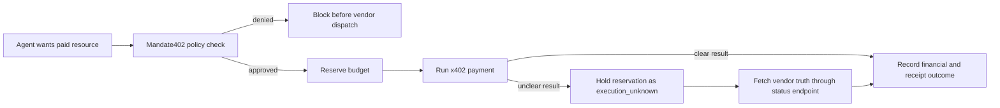

# Mandate402 Project Overview

Mandate402 is a governance and treasury control layer for x402 machine payments on Morph. It is designed for teams that want software agents to buy paid services without handing those agents unrestricted spending power.

This document is for readers who want the product explanation, scope, and why the project exists.

## 1. One-Sentence Definition

Mandate402 gives an organization a way to define who an agent may pay, how much it may spend, when that authority expires, what evidence must be returned, and how that authority can be revoked.

## 2. The Problem

x402 makes it possible for software to pay for HTTP resources through a standard payment challenge flow.

That solves the payment transport problem. It does not solve the operating problem that appears once a real organization funds those payments:

- Which vendors is the agent allowed to buy from?
- What budget does the agent have?
- What happens if the vendor responds slowly and the final outcome is unclear?
- How is spend revoked if the agent misbehaves?
- How do operators and treasury owners review what happened?

Without those controls, an agent can spend correctly at the protocol level and still violate organizational policy.

## 3. The Core Idea

The project replaces raw spend access with a mandate.

A mandate is a policy object that defines:

- the agent receiving authority
- a spend cap
- an expiry time
- an approved vendor list
- whether receipt capability is required
- the ability to revoke the authority later

The practical idea is simple: let agents request paid actions, but let policy decide whether treasury value is allowed to leave the system.

## 4. What Mandate402 Is

Mandate402 is:

- a policy gate in front of x402-paid vendor calls
- a runtime that reserves budget before dispatch
- a reconciliation layer for ambiguous outcomes
- an audit and domain-event trail for each attempt
- a Morph-native anchor for mandate issue and revoke lifecycle events

## 5. What Mandate402 Is Not

Mandate402 is not:

- the paid vendor itself
- the x402 facilitator
- a general-purpose wallet
- a full accounting suite
- a replacement for organizational finance policy

It is a control layer that sits between payment intent and payment execution.

## 6. Why It Exists

The useful question for an organization is not "Can an AI agent pay?"

The useful question is:

> Can an AI agent buy a paid service within explicit treasury rules, and can the organization later explain exactly why the payment was allowed, blocked, or left unresolved?

Mandate402 exists to make that question operational.

## 7. How It Works

### Human view

1. An operator creates a mandate for an agent.
2. The operator names approved vendors and a budget boundary.
3. The operator runs or reviews a payment attempt.
4. If the attempt is blocked, the reason is recorded.
5. If the outcome is ambiguous, the reservation stays held until reconciliation finishes.
6. The operator can revoke the mandate later.

### Runtime view

The important design choice is that Mandate402 does not guess final truth when the network is ambiguous. It holds the reservation until the vendor status endpoint confirms what actually happened.

## 8. Why Morph, x402, and Pyth Each Matter

### Morph

Morph provides the chain environment for contract anchoring and treasury-oriented contract logic.

### x402

x402 provides the payment interaction pattern between buyer and paid HTTP service.

### Pyth

Pyth provides a fiat reference for the treasury contract so spend limits can be expressed in USD-like terms instead of raw token units alone.

Each part has a different job. Mandate402 combines them into a spend-control workflow.

## 9. Example Scenario

Consider a research agent that needs access to a paid market-data endpoint.

Without Mandate402:

- the agent needs direct payment capability
- the treasury has limited control over where the money goes
- a timeout can leave the team unsure whether a charge succeeded

With Mandate402:

- the agent only attempts payments within a named mandate
- the vendor must be on the approved list
- the amount must fit inside the remaining budget
- receipt capability can be required
- if the charge outcome is unclear, the system marks it `execution_unknown` and reconciles it later

## 10. Why the Project Is Structured This Way

The repository deliberately keeps the major roles separate:

- Next.js app: operator UI, API routes, policy runtime
- SQLite runtime store: local source of operational truth
- Go x402 merchant: paid vendor behavior for demo and testing
- Morph contracts: lifecycle anchor and treasury-rule surface

This makes it possible to demonstrate the full operator loop without pretending that the control layer and the vendor are the same thing.

## 11. Current MVP Scope

The current MVP proves a narrow but complete loop:

- create a mandate
- run one approved attempt
- block one invalid attempt before vendor execution
- surface financial and receipt outcomes separately
- reconcile an ambiguous attempt
- revoke the mandate

That scope is intentionally small. The goal is to prove that governed machine spend works end to end before widening into richer vendor catalogs, more elaborate roles, or deeper compliance workflows.

## 12. Who This Is For

Mandate402 is relevant to teams that already believe agents should be allowed to buy things, but do not want to expose treasury value without controls.

Typical users include:

- AI product teams running paid research or data agents
- infrastructure teams exposing x402-paid internal tools
- operators who need a revocation and audit path
- treasury and security stakeholders who need visible controls around agent spend

## 13. Analogy

The closest analogy is:

> an expense-policy layer for autonomous agents

It plays a role similar to spend controls on a corporate card:

- approved merchants
- spending limits
- expiry
- evidence requirements
- revocation

The difference is that the "cardholder" is software and the purchase target is an x402-paid service.

## 14. Current Status

In this repository today:

- the operator app is implemented in Next.js
- the runtime stores mandates, attempts, audit entries, and domain events in SQLite
- the demo vendor service is implemented in Go with x402 middleware
- mandate issue and revoke can be anchored on Morph when runtime credentials are configured, with demo tx identifiers used otherwise
- the treasury contract models fiat-window guardrails and facilitator allowlists

The project is therefore more than a concept note, but it is still an MVP with a deliberately constrained operating surface.
