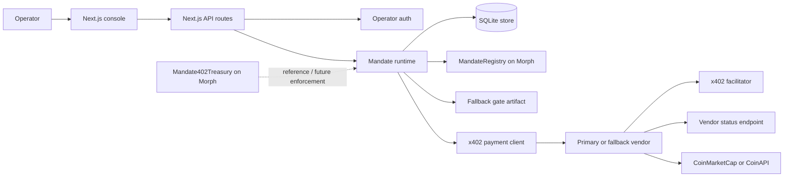
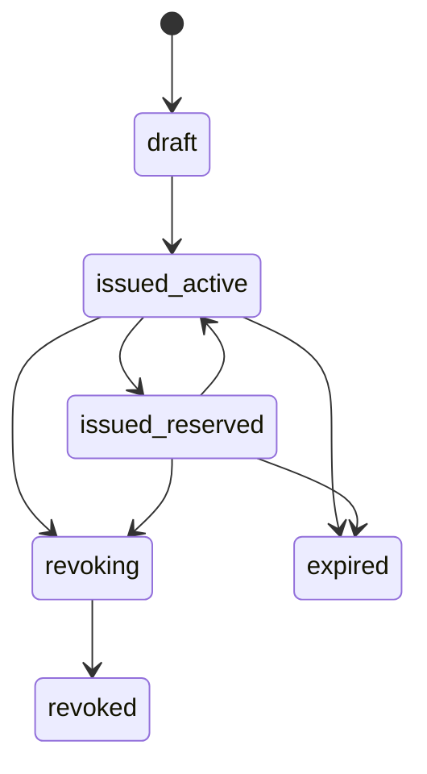
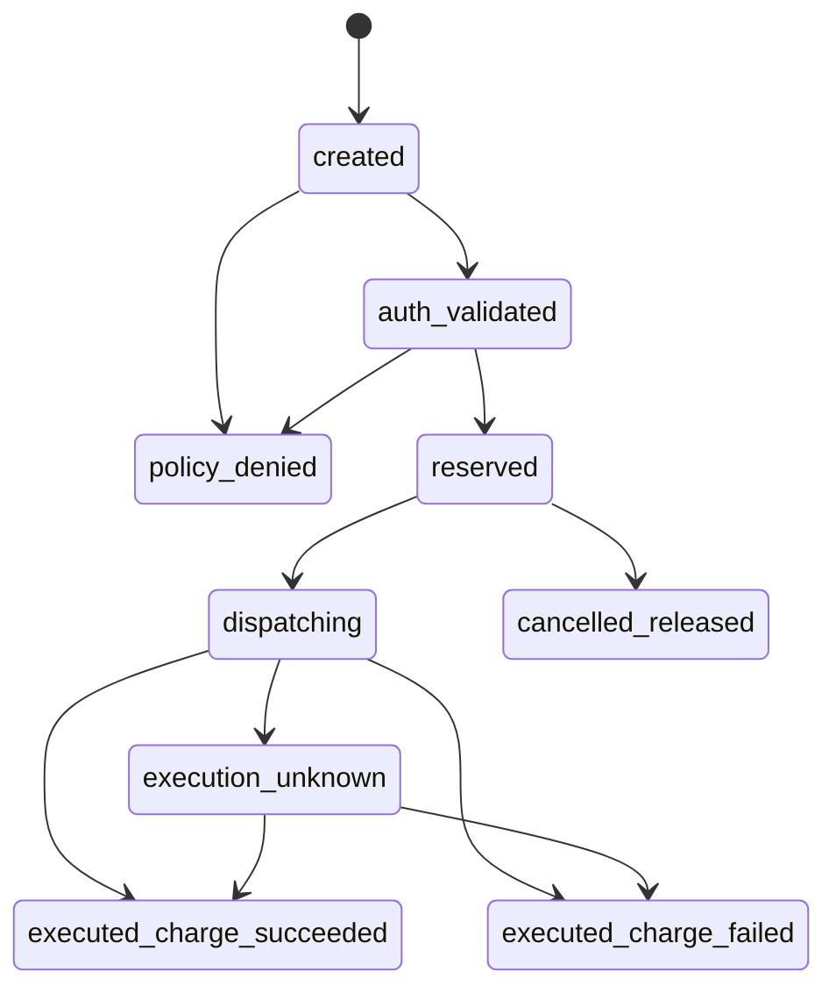
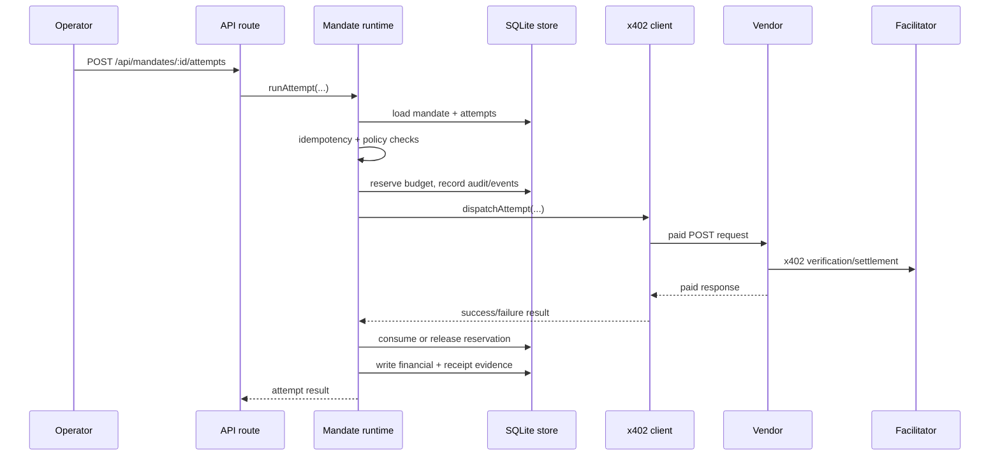

# Mandate402 System Design

This document describes the current Mandate402 MVP as implemented in this repository. It focuses on the real control boundaries, runtime behavior, data model, and contract responsibilities instead of describing an aspirational architecture.

This document is for engineers, reviewers, and technical contributors who need the implementation-grounded system view.

## 1. Purpose

Mandate402 is the governance and treasury control layer that sits between:

- an operator-approved agent
- an x402-paid vendor endpoint
- the payment facilitator infrastructure
- the treasury that ultimately funds machine spend

The system does not replace the vendor and does not replace the facilitator. Its job is to decide whether a payment should be allowed, reserve budget before dispatch, keep evidence after dispatch, and handle ambiguous outcomes without losing financial truth.

## 2. System Boundary

| Component | Role | Current implementation |
|---|---|---|
| Operator console | Human control surface | Next.js app under `src/` |
| API layer | Mandate, attempt, revoke, reconcile, status endpoints | `src/app/api/**` |
| Policy runtime | Auth, policy checks, idempotency, reservation, audit, reconciliation | `src/lib/modules/**` |
| Persistence | Runtime state, audit history, domain events | SQLite in `data/mandate402.sqlite` |
| Vendor registry | Declares allowed vendor identities and capabilities | `src/lib/vendor-registry.ts` |
| x402 buyer path | Pays x402-protected vendor endpoints | `@x402/*` client in `src/lib/infrastructure/x402-client.ts` |
| Demo vendors | Paid HTTP endpoints plus `/status` reconciliation endpoints | `main.go` |
| Morph anchor | Lifecycle anchor for issue/revoke when runtime chain credentials are configured | `contracts/src/MandateRegistry.sol` and `src/lib/modules/morph-anchor.ts` |
| Treasury contract | Onchain fiat-window guardrails and facilitator allowlists | `contracts/src/Mandate402Treasury.sol` |
| Fallback governance | Controls when a wrapper vendor may be used | `config/mandate402-fallback-gate.md` |

## 3. Architectural Stance

Mandate402 keeps several responsibilities separate on purpose:

- Vendor: provides the paid service being bought.
- Facilitator: verifies and settles the x402 payment flow.
- Mandate402: decides whether the agent is allowed to spend and records the outcome.
- Oracle: provides a fiat-denominated reference for treasury limits.
- Morph contract layer: anchors mandate lifecycle and models onchain treasury rules.

If those roles are collapsed into one service, it becomes hard to audit who decided, who executed, and who confirmed final payment truth.

## 4. Runtime Architecture

Two important notes:

1. The app currently writes lifecycle anchors through the `MandateRegistry` ABI.
2. The `Mandate402Treasury` contract encodes onchain spend-policy semantics, but the current Next.js payment path does not call it during every attempt.

## 5. Code-Level Component Map

### 5.1 Next.js API layer

The operator-facing API surface is small and explicit:

- `GET /api/mandates`
- `POST /api/mandates`
- `POST /api/mandates/:mandateId/attempts`
- `POST /api/mandates/:mandateId/attempts/:attemptId/reconcile`
- `POST /api/mandates/:mandateId/revoke`
- `GET /api/vendors`
- `GET /api/fallback-gate`
- `GET /api/system`

`POST` routes require operator authentication. `GET /api/system` exposes aggregate runtime health, including how many attempts are still in `execution_unknown`.

### 5.2 Runtime modules

| Module | Responsibility |
|---|---|
| `src/lib/modules/auth.ts` | Validates the operator token and assigns operator context |
| `src/lib/modules/mandates.ts` | Create mandate, revoke mandate, run attempt, reconcile attempt |
| `src/lib/modules/policy.ts` | Enforces allowlist, receipt capability, expiry, and budget rules |
| `src/lib/modules/payments.ts` | Dispatches to vendor endpoints and correlates ambiguous outcomes |
| `src/lib/modules/morph-anchor.ts` | Writes mandate issue/revoke anchors to Morph |
| `src/lib/infrastructure/store.ts` | SQLite schema, seeding, read/write, serialization lock |
| `src/lib/infrastructure/fallback-gate.ts` | Parses and validates fallback activation rules |
| `src/lib/infrastructure/system-status.ts` | Builds `/api/system` health summary |

### 5.3 Demo vendor service

`main.go` exposes two x402-paid vendor routes:

- `POST /x402_demo/api/market-data`
- `POST /x402_demo/api/research`

And two reconciliation routes:

- `POST /x402_demo/api/market-data/status`
- `POST /x402_demo/api/research/status`

The market-data route returns quickly. The research route intentionally sleeps for nine seconds so the Next.js app times out after eight seconds, forcing an `execution_unknown` state and later reconciliation.

## 6. Persistence Model

Runtime data is stored in `data/mandate402.sqlite`. The schema is normalized around:

- `agents`
- `mandates`
- `mandate_approved_vendors`
- `attempts`
- `audit_entries`
- `domain_events`

`withStoreLock` serializes mutations so each mandate operation reads a coherent snapshot, mutates it, and writes it back without interleaving another write mid-operation.

### 6.1 Core entities

#### Agent

- identity for the actor receiving spend authority
- currently either `active` or `revoked`

#### Mandate

- human-readable name
- linked `agentId`
- budget cap in cents
- reserved and consumed counters
- receipt requirement flag
- approved vendor IDs
- Morph issue/revoke transaction references
- expiry timestamp

#### Payment attempt

- linked mandate and vendor
- amount in cents
- operator ID
- `paymentIdentifier` for idempotency
- financial outcome
- receipt evidence outcome
- optional blocked reason
- optional charge reference

#### Audit entry

- operator-readable timeline entry
- attached to a mandate and optionally an attempt

#### Domain event

- structured machine-readable event
- includes `entityType`, `entityId`, `eventType`, `correlationId`, and metadata

## 7. State Machines

### 7.1 Mandate states

Meaning:

- `draft` exists only briefly after the issue-anchor call returns and before the mandate is immediately transitioned to `issued_active`.
- `issued_active` means the mandate can authorize a new reservation.
- `issued_reserved` means one attempt currently holds budget.
- `revoking` is the in-between state while the revoke anchor is being written.
- `expired` and `revoked` are fail-closed for new attempts.

### 7.2 Payment attempt states

The design deliberately separates:

- payment execution truth
- receipt evidence truth

A charge can succeed while receipt evidence is still pending or later marked invalid.

## 8. End-to-End Flows

### 8.1 Mandate creation

1. Operator calls `POST /api/mandates`.
2. `requireOperator` validates the operator token.
3. Request body is validated with `zod`.
4. `createMandate` checks that the expiry is in the future and the agent exists and is active.
5. `issueMandateAnchor` writes a Morph anchor through `MandateRegistry`, or emits a synthetic `demo_*` tx id if runtime chain credentials are missing.
6. The mandate transitions `draft -> issued_active`.
7. The mandate is stored.
8. A `mandate_issued` audit entry and domain event are recorded.

### 8.2 Approved payment flow

Runtime rules in this flow:

- Auth is checked before dispatch.
- Idempotency is checked before dispatch.
- Policy is checked before dispatch.
- Budget is reserved before dispatch.
- Audit entries and domain events are emitted as the attempt progresses.

### 8.3 Blocked payment flow

An attempt is blocked before vendor execution if any of the following policy conditions fails:

- mandate is not active
- mandate is expired
- mandate already has a live reservation
- vendor is not allowlisted
- receipt capability is required but the vendor lacks it
- available budget is below requested amount

In that case:

- the attempt transitions to `policy_denied`
- `blockedReason` is recorded
- no vendor adapter call is made
- no treasury value leaves the system

Vendor existence is checked one step earlier. If the request names an unknown vendor ID, `runAttempt` throws `Vendor not found.` before an attempt record is materialized.

### 8.4 Unknown outcome and reconciliation

The payment dispatcher uses an eight-second timeout. If the vendor does not respond in time:

- the attempt becomes `execution_unknown`
- the reservation remains held
- the mandate stays in `issued_reserved`
- audit and event streams record that reconciliation is required

The operator can then call `POST /api/mandates/:mandateId/attempts/:attemptId/reconcile`.

Reconciliation behavior:

1. The runtime fetches truth from the vendor `/status` endpoint.
2. The caller does not provide the final payment result.
3. The attempt transitions from `execution_unknown` to either `executed_charge_succeeded` or `executed_charge_failed`.
4. Reserved budget is released.
5. Consumed budget is increased only if the charge actually succeeded.
6. Receipt evidence is updated independently.
7. The mandate returns to `issued_active`.

This is the core distributed-systems rule in the project:

> `execution_unknown` is unresolved state, not failure and not success.

### 8.5 Revocation flow

1. Operator calls `POST /api/mandates/:mandateId/revoke`.
2. `revokeMandate` transitions `issued_active/issued_reserved -> revoking`.
3. `revokeMandateAnchor` writes the revoke anchor to Morph, or emits a synthetic `demo_*` tx id when chain credentials are missing.
4. The mandate transitions `revoking -> revoked`.
5. Audit and domain-event evidence is written.

## 9. Policy Semantics

The current request path enforces seven concrete checks across vendor lookup and policy evaluation:

1. vendor must exist
2. mandate must be `issued_active`
3. mandate expiry must still be in the future
4. mandate must be reservable
5. vendor must be allowlisted by ID
6. vendor must expose receipt capability if the mandate requires it
7. available budget must cover the requested amount

Budget math is:

`availableBudgetCents = budgetCapCents - consumedCents - reservedCents`

The current MVP allows only one active reservation per mandate because `mandateCanReserve` requires `reservedCents === 0`.

## 10. Idempotency

`paymentIdentifier` is the semantic idempotency key for an attempt.

Behavior:

- same identifier + same mandate/vendor/amount/operator => return the existing attempt
- same identifier + different semantics => fail with a conflict

This prevents retry confusion and blocks accidental double spending with reused identifiers.

## 11. Fallback Wrapper Governance

Fallback execution is not a default vendor path. It is gated by `config/mandate402-fallback-gate.md`.

The wrapper is allowed only if all are true:

- decision status is `fallback_approved` or `fallback_activated`
- cutoff date has passed
- at least two primary targets are declared
- all primary targets have recorded attempt evidence
- every attempt has a non-empty evidence reference

This prevents the demo wrapper from silently becoming the real product path.

## 12. Onchain Design

### 12.1 `MandateRegistry`

`MandateRegistry.sol` is the minimal lifecycle anchor contract.

It stores:

- `specHash`
- `revokeRef`
- issuer and revoker addresses
- issue and revoke timestamps
- mandate status (`Unissued`, `Active`, `Revoked`)

It emits:

- `MandateIssued`
- `MandateRevoked`

The current app-side anchor writer in `morph-anchor.ts` is built around this interface.
The current app path does not anchor the full mandate payload onchain. It hashes the local mandate identifier plus synthetic `issue:` and `revoke:` reference strings.

### 12.2 `Mandate402Treasury`

`Mandate402Treasury.sol` models the onchain treasury-control layer:

- governance owner
- agent-specific kill switch
- approved facilitator mapping
- token-specific mandate configuration
- fiat-denominated spend window using Pyth price feeds

Its `executeX402Payment` function enforces:

- mandate must be active
- kill switch must be off
- facilitator must be approved
- fiat spend within the current window must stay below limit

This contract captures the long-term onchain policy semantics, even though the current Next.js attempt runtime enforces policy offchain first.

## 13. External Integrations

### Morph

Morph is used for:

- mandate issue/revoke anchoring
- contract deployment
- x402-aligned infrastructure configuration

### x402

x402 is used for:

- payment challenge/settlement behavior for paid HTTP routes
- buyer-side request wrapping in the Next.js runtime
- vendor-side verification middleware in the Go service

### Pyth

Pyth is used in the treasury contract for:

- fiat-referenced spend limits
- volatility-aware USD window enforcement

### CoinMarketCap / CoinAPI

These are upstream data sources for the Go demo vendor. They are not treasury infrastructure and they are not the payment facilitator.

### Environment defaults

The app and the Go demo merchant do not share the same defaults:

- the Next.js app defaults to Morph mainnet-style RPC and chain settings unless env overrides are supplied
- the Go demo merchant defaults to Hoodi testnet chain `2910` and Hoodi facilitator URLs

For a coherent local or demo environment, those values should be aligned explicitly through environment configuration.

## 14. Observability

The runtime keeps three evidence channels:

1. `audit_entries` for human-readable explanations
2. `domain_events` for structured machine-readable events
3. route-level structured logs via `logEvent`

`correlationId` is propagated from request headers or generated if absent. `GET /api/system` exposes:

- entity counts
- number of unknown attempts
- fallback decision status

## 15. Security and Trust Assumptions

- Mutating routes require an operator token.
- The default operator token is a demo value and is not sufficient for production.
- Private keys for Morph anchor writes and x402 buying come from environment variables.
- Reconciliation trusts vendor status endpoints, not caller-supplied final status.
- Secrets and private keys must remain out of tracked files.

## 16. Current MVP Limitations

The current repository is intentionally narrow:

- operator auth is single-token and simple
- persistence is local SQLite
- write serialization is single-process only and not multi-instance safe
- vendor endpoints are environment-configured
- `/api/vendors` returns static registry metadata, not live vendor health
- the Go vendor is a demo merchant, not a marketplace of independent vendors
- the app anchors lifecycle onchain but keeps primary spend authorization offchain
- the treasury contract is implemented, tested, and deployable, but not yet invoked inside each Next.js payment attempt

That scope is deliberate. The MVP proves the control model first: allow, block, reserve, reconcile, revoke, and audit.
