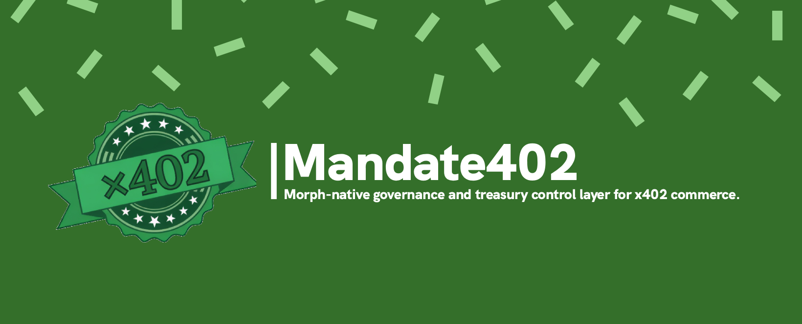

# Mandate402 Brand Kit

Mandate402 is a high-trust treasury-control system for x402 machine commerce on Morph. This brand kit is recovered from the restored Sherwin wireframe ADR and the current implemented token layer.

<strong>Identity</strong>

<table>
  <tr>
    <th>Element</th>
    <th>Definition</th>
  </tr>
  <tr>
    <td>Brand posture</td>
    <td>High-trust treasury-control system</td>
  </tr>
  <tr>
    <td>Primary visual direction</td>
    <td>Deep control-room teal and graphite hero bands, bright verification-green pill CTA, stark white product surfaces below dark hero regions</td>
  </tr>
  <tr>
    <td>Component language</td>
    <td>Universal pill buttons, 12px rounded cards, precise operational spacing, dark proof surfaces for ledger, policy, and audit context</td>
  </tr>
  <tr>
    <td>Do</td>
    <td>Operational, high-contrast, serious treasury-control feel</td>
  </tr>
  <tr>
    <td>Do not</td>
    <td>Consumer-neobank styling, generic all-white marketing layouts, square buttons, overuse of bright green on large fills</td>
  </tr>
</table>

<strong>Typography</strong>

<table>
  <tr>
    <th>Role</th>
    <th>Font</th>
    <th>Download</th>
  </tr>
  <tr>
    <td>Primary UI typeface</td>
    <td><code>Sora</code></td>
    <td><a href="https://fonts.google.com/specimen/Sora">Google Fonts</a></td>
  </tr>
  <tr>
    <td>Policy / receipt / transaction reference surfaces</td>
    <td><code>IBM Plex Mono</code></td>
    <td><a href="https://fonts.google.com/specimen/IBM+Plex+Mono">Google Fonts</a></td>
  </tr>
</table>

<strong>Brand And Accent Palette</strong>

<table>
  <tr>
    <th>Token</th>
    <th>Purpose</th>
  </tr>
  <tr>
    <td>Mandate Green</td>
    <td>Primary CTA, approval state, active success signal</td>
  </tr>
  <tr>
    <td>Mandate Green Dark</td>
    <td>Active link color, pressed state, strong success emphasis</td>
  </tr>
  <tr>
    <td>Mandate Green Mid</td>
    <td>Supporting green for softer accents and gradients</td>
  </tr>
  <tr>
    <td>Mandate Mint Soft</td>
    <td>Pale mint tint for featured states and positive policy surfaces</td>
  </tr>
  <tr>
    <td>Control Teal Deep</td>
    <td>Dark hero, footer, control-room, and policy surfaces</td>
  </tr>
  <tr>
    <td>Control Teal</td>
    <td>Mid-tone control accent</td>
  </tr>
  <tr>
    <td>Control Teal Mid</td>
    <td>Lighter teal for highlighted platform surfaces</td>
  </tr>
</table>

<strong>Category Accents</strong>

<table>
  <tr>
    <th>Token</th>
    <th>Purpose</th>
  </tr>
  <tr>
    <td>Governance Purple</td>
    <td>Governance and permissions tags</td>
  </tr>
  <tr>
    <td>Payment Orange</td>
    <td>Payments and settlement tags</td>
  </tr>
  <tr>
    <td>Compliance Red</td>
    <td>Compliance and audit tags</td>
  </tr>
  <tr>
    <td>Agent Blue</td>
    <td>Agent and orchestration tags</td>
  </tr>
</table>

<strong>Surface Palette</strong>

<table>
  <tr>
    <th>Token</th>
    <th>Purpose</th>
  </tr>
  <tr>
    <td>Canvas White</td>
    <td>Default page background and standard card surface</td>
  </tr>
  <tr>
    <td>Canvas Dark</td>
    <td>Code panels, receipt logs, and policy terminal backgrounds</td>
  </tr>
  <tr>
    <td>Surface</td>
    <td>Subtle section background</td>
  </tr>
  <tr>
    <td>Surface Soft</td>
    <td>Quiet section-break background</td>
  </tr>
  <tr>
    <td>Surface Feature</td>
    <td>Pale mint background for featured states</td>
  </tr>
  <tr>
    <td>Hairline</td>
    <td>Default border</td>
  </tr>
  <tr>
    <td>Hairline Soft</td>
    <td>Low-contrast divider</td>
  </tr>
  <tr>
    <td>Hairline Strong</td>
    <td>Input and stronger structural boundary</td>
  </tr>
  <tr>
    <td>Hairline Dark</td>
    <td>Border color for dark surfaces</td>
  </tr>
</table>

<strong>Text Palette</strong>

<table>
  <tr>
    <th>Token</th>
    <th>Purpose</th>
  </tr>
  <tr>
    <td>Ink</td>
    <td>Primary headline and body text</td>
  </tr>
  <tr>
    <td>Charcoal</td>
    <td>Emphasized body text</td>
  </tr>
  <tr>
    <td>Slate</td>
    <td>Secondary text</td>
  </tr>
  <tr>
    <td>Steel</td>
    <td>Tertiary text and captions</td>
  </tr>
  <tr>
    <td>Stone</td>
    <td>Muted labels</td>
  </tr>
  <tr>
    <td>Muted</td>
    <td>Disabled and placeholder text</td>
  </tr>
  <tr>
    <td>On Dark</td>
    <td>White text on dark surfaces</td>
  </tr>
  <tr>
    <td>On Dark Muted</td>
    <td>Reduced-contrast white text on dark surfaces</td>
  </tr>
</table>

<strong>Semantic Palette</strong>

<table>
  <tr>
    <th>Token</th>
    <th>Purpose</th>
  </tr>
  <tr>
    <td>Success Background</td>
    <td>Pale green approval surface</td>
  </tr>
  <tr>
    <td>Success Text</td>
    <td>Approval copy and valid-state text</td>
  </tr>
  <tr>
    <td>Warning Background</td>
    <td>Pale amber warning surface</td>
  </tr>
  <tr>
    <td>Warning Text</td>
    <td>Warning-state copy</td>
  </tr>
  <tr>
    <td>Blocked Background</td>
    <td>Soft red blocked or denied surface</td>
  </tr>
  <tr>
    <td>Blocked Text</td>
    <td>Denied or revoked text color</td>
  </tr>
</table>

<strong>Implemented CSS Tokens</strong>

<table>
  <tr>
    <th>CSS Token</th>
    <th>Value</th>
  </tr>
  <tr>
    <td><code>--color-mandate-green</code></td>
    <td><code>#22c55e</code></td>
  </tr>
  <tr>
    <td><code>--color-mandate-green-dark</code></td>
    <td><code>#15803d</code></td>
  </tr>
  <tr>
    <td><code>--color-brand-control-deep</code></td>
    <td><code>#062b33</code></td>
  </tr>
  <tr>
    <td><code>--color-ink</code></td>
    <td><code>#0f1720</code></td>
  </tr>
  <tr>
    <td><code>--color-charcoal</code></td>
    <td><code>#1f2937</code></td>
  </tr>
  <tr>
    <td><code>--color-slate</code></td>
    <td><code>#475569</code></td>
  </tr>
  <tr>
    <td><code>--color-steel</code></td>
    <td><code>#64748b</code></td>
  </tr>
  <tr>
    <td><code>--color-hairline</code></td>
    <td><code>#e4ece9</code></td>
  </tr>
  <tr>
    <td><code>--color-canvas</code></td>
    <td><code>#ffffff</code></td>
  </tr>
  <tr>
    <td><code>--color-surface</code></td>
    <td><code>#f7faf9</code></td>
  </tr>
</table>

<strong>Usage Rules</strong>

<table>
  <tr>
    <th>Rule</th>
    <th>Direction</th>
  </tr>
  <tr>
    <td>Bright green usage</td>
    <td>Main action signal, not a default fill color for large areas</td>
  </tr>
  <tr>
    <td>Dark control-teal usage</td>
    <td>Frame trust, policy, and treasury-control areas</td>
  </tr>
  <tr>
    <td>Accent usage</td>
    <td>Use category accents sparingly for tags, chips, and encoded labels</td>
  </tr>
  <tr>
    <td>State clarity</td>
    <td>Blocked, warning, and success states must be distinguishable at a glance</td>
  </tr>
  <tr>
    <td>Overall mood</td>
    <td>Professional control-plane feel, not playful or speculative crypto styling</td>
  </tr>
</table>

